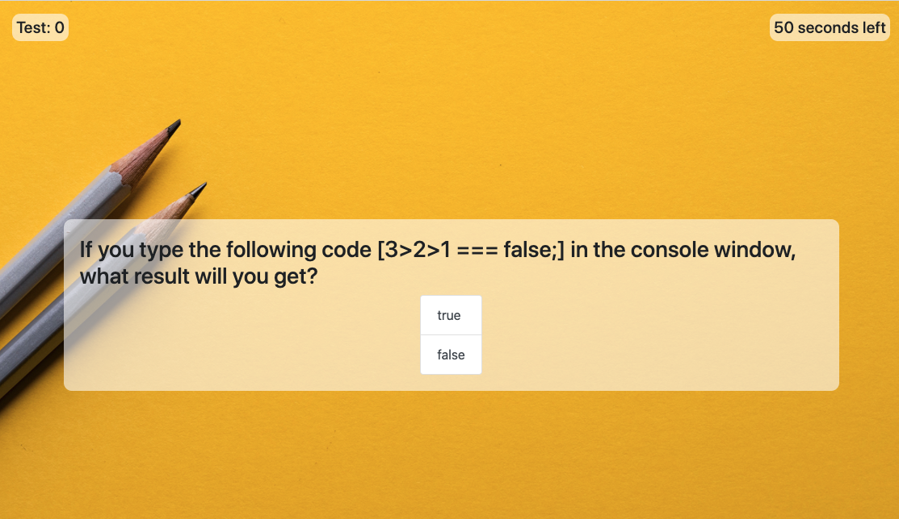
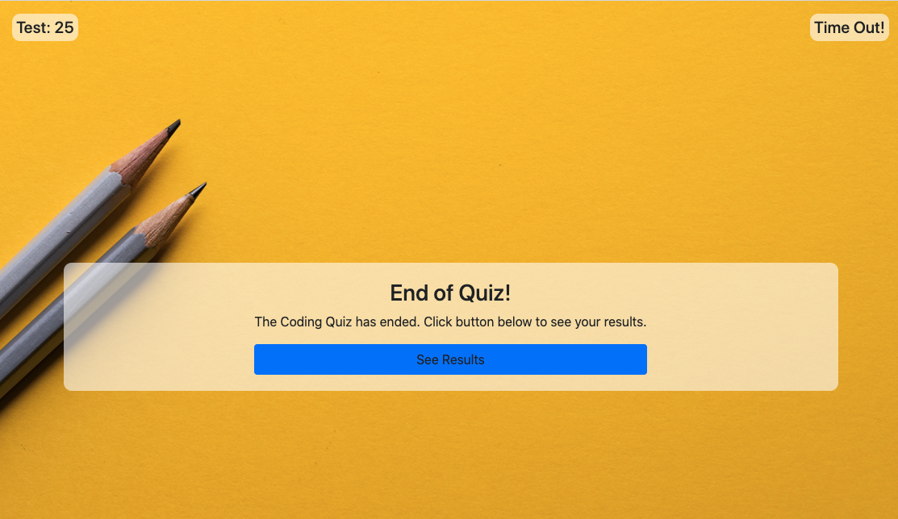
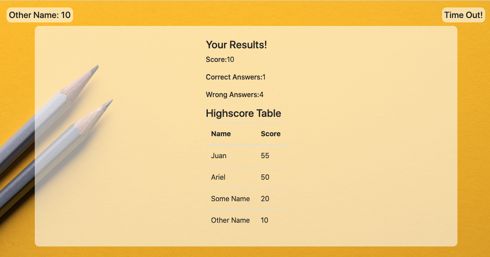

# Coding Quiz App


## Description

Web application created with HTML, CSS and Javascript with purpose of check coding knowledge of beginner developers.
It consist of a timed code quiz with multiple-choice questions. This app will run in the browser and feature dynamically updated HTML and CSS powered by your JavaScript code. It will also feature a clean and polished user interface and be responsive, ensuring that it adapts to multiple screen sizes.

## Table of Content

- [User Story](#User-Story)
- [Installation](#Installation)
- [Usage](#Usage)
- [Technologies-Used](#Technologies-Used)
- [Contributing](#Contributing)
- [Tests](#Tests)
- [License](#License)
- [Questions](#Questions)

## User-Story
```
AS A coding bootcamp student
I WANT to take a timed quiz on JavaScript fundamentals that stores high scores
SO THAT I can gauge my progress compared to my peers
```

## Installation

No special treatment is required. App runs on Github Pages but if cloned, run it normally in your default browser.

## Usage

Initial page requests name of person taking quiz to keep log of scored points. Once started, user will have a total of 60 seconds to complete the quiz. For every wrong-answered question, timer will reduce in a number of seconds defined in each question.
Once either the time reaches zero (0) or all the questions are answered, the user will be prompted to End of Quiz screen where can choose to see all results and a score board sorted by score (desc).









## Technologies-Used

- HTML5
- CSS3
- Javascript

## Contributing

| Name           | Github           |
| -------------- | ---------------- |
| Ariel Cuesta   | arielcc88        |

## Tests

Testing is not integrated at the moment.

## License

MIT

## Questions

Want to get in touch? Report bugs and enhancements? Contact any of the contributors listed above.
