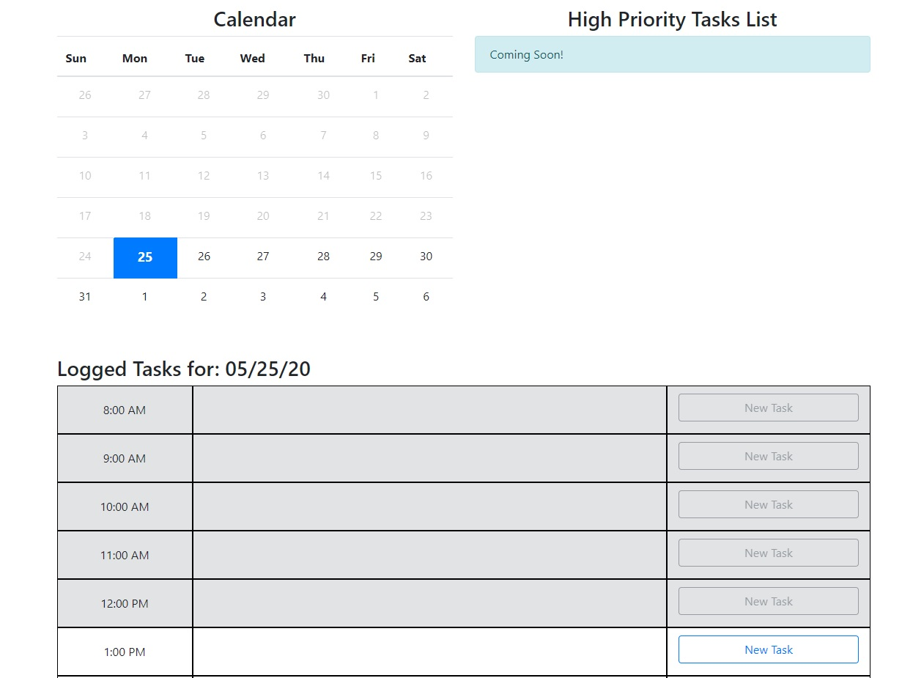
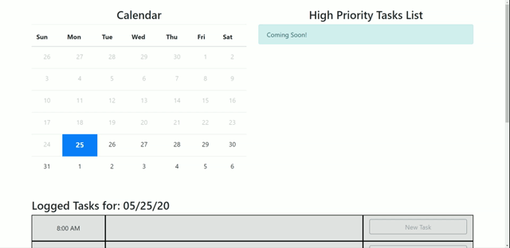

# Daily Planner v1.0
Web Application intended to help organize your day. The app allows you to check logged task during bussines hours (default 8am - 5pm but can be changed) for all days of the current month.
The current state of the project is Phase 1. It allows for adding new tasks and changing the status of tasks from Pending(default) to Completed or Cancelled.


|Project Name: |Daily Planner|
| --------------- | --------------- |
|Developer:| Ariel Cuesta|
| --------------- | --------------- |
|Collaborators:| None|
| --------------- | --------------- |
|Purpose:| Intended to help organize better your laboral day.|
| --------------- | --------------- |
|Dev. Technologies:| HTML, CSS, Javascript (jQuery)|
| --------------- | --------------- |

## A view of your planner!!!



## User Story

```
AS AN employee with a busy schedule
I WANT to add important events to a daily planner
SO THAT I can manage my time effectively
```

## Acceptance Criteria

```
GIVEN I am using a daily planner to create a schedule
WHEN I open the planner
THEN the current day is displayed at the top of the calendar
WHEN I scroll down
THEN I am presented with timeblocks for standard business hours
WHEN I view the timeblocks for that day
THEN each timeblock is color coded to indicate whether it is in the past, present, or future
WHEN I click into a timeblock
THEN I can enter an event
WHEN I click the save button for that timeblock
THEN the text for that event is saved in local storage
WHEN I refresh the page
THEN the saved events persist
```

## Logging a New task

The App by default displays the current day business hours with any logged task for that day. At the top it canbe found a calendar and a section for high priority tasks (this High priority task section is still under developement).
The calendar allows the user to review logged tasks for any given day of the curren month by simply clicking on the numbers.
Logging a New Task is as simple as clicking on the --New Task-- button shown on the Logged Tasks section.

Important to Note:
1- The app will let you add new task only if the time slot for such task is the present hour or future hours. You will not be able to add new task if the time has passed.
2- Depending on the status of the task (Pending, Completed, Cancelled) the Task Grid will display color coded tasks.


## Changing Status of a Task

Changing the status of an existing task is possible by only clicking on the Task Title in the Task Grid. A modal pop-up will show up with a Status dropdown. Simply select the new status and click on Update Task.




## Using Calendar to review other day's tasks
Click on a day number in the calendat to see its tasks (if any was logged that day).


