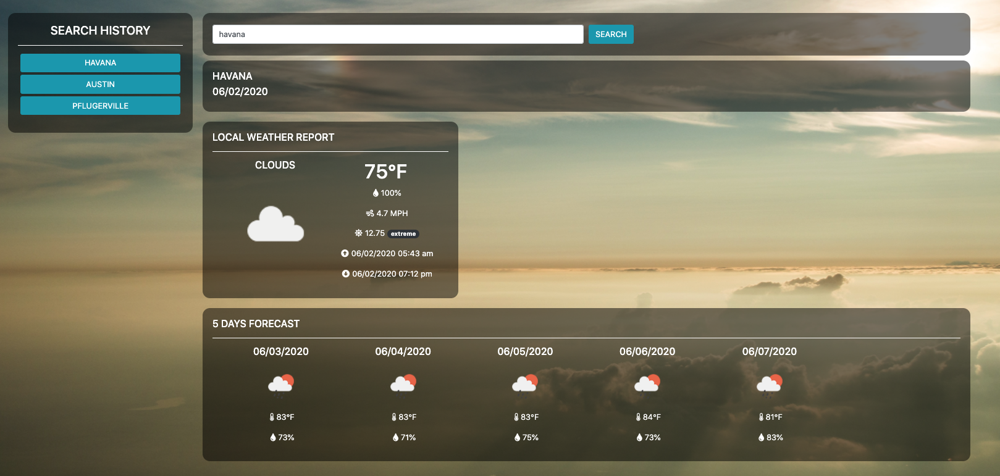

# Weather Dashboard
Fast web app for a quick weather check.
Data Source: Open Weather API.
Background image by Anton Nikolov.

## Deployed Link
[Weather Dashboard](https://arielcc88.github.io/UT-FSWD-DEPLOYED/weather_dashboard/)


|Project Name: |Weather Dashboard|
| --------------- | --------------- |
|Developer:| Ariel Cuesta|
| --------------- | --------------- |
|Collaborators:| None|
| --------------- | --------------- |
|Purpose:| Quick weather conditions check.|
| --------------- | --------------- |
|Dev. Technologies:| HTML, CSS, Javascript (jQuery), OpenWeather API|
| --------------- | --------------- |

## Weather Dashboard View!!!



## Local Weather Report Legend
```
To the left: 
Main weather conditions and representative weather icon.
To the right:
- Temperature
- Humidity
- Wind Speed
- UVI (severity)
- Sunrise
- Sunset 
```

## User Story

```
AS A traveler
I WANT to see the weather outlook for multiple cities
SO THAT I can plan a trip accordingly
```

## Acceptance Criteria

```
GIVEN a weather dashboard with form inputs
WHEN I search for a city
THEN I am presented with current and future conditions for that city and that city is added to the search history
WHEN I view current weather conditions for that city
THEN I am presented with the city name, the date, an icon representation of weather conditions, the temperature, the humidity, the wind speed, and the UV index
WHEN I view the UV index
THEN I am presented with a color that indicates whether the conditions are favorable, moderate, or severe
WHEN I view future weather conditions for that city
THEN I am presented with a 5-day forecast that displays the date, an icon representation of weather conditions, the temperature, and the humidity
WHEN I click on a city in the search history
THEN I am again presented with current and future conditions for that city
WHEN I open the weather dashboard
THEN I am presented with the last searched city forecast
```